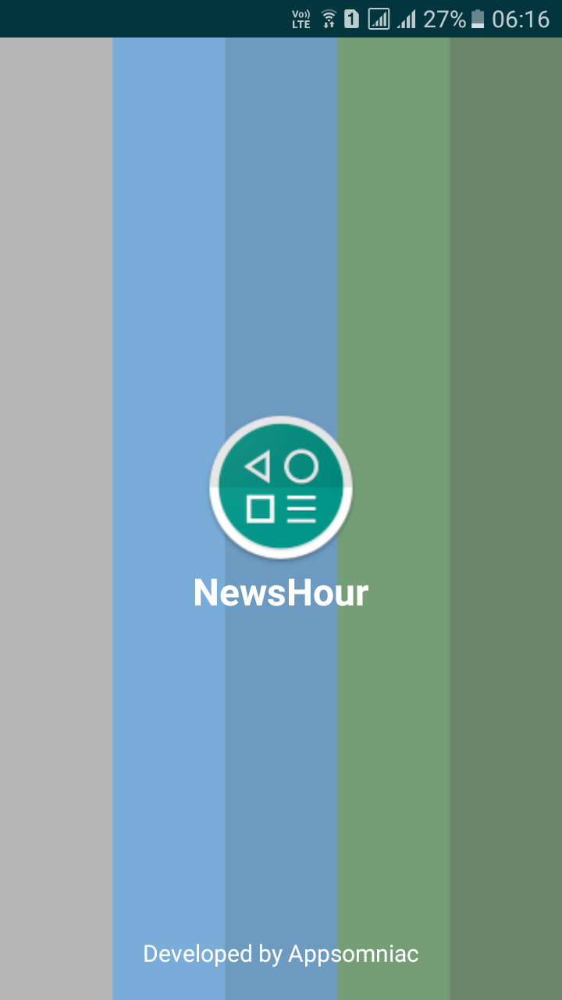
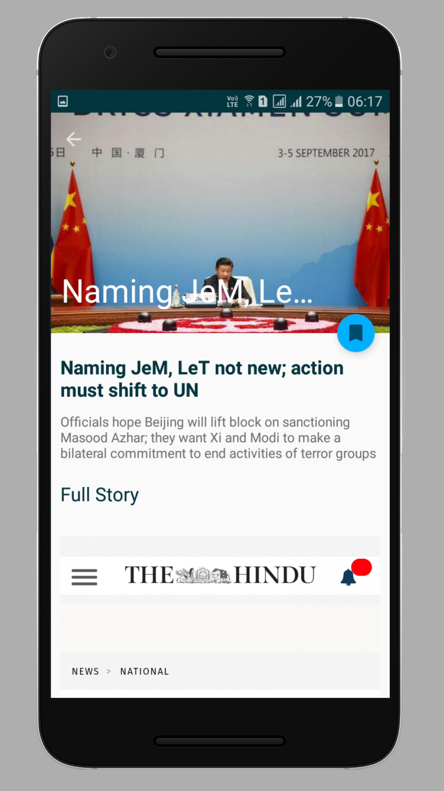
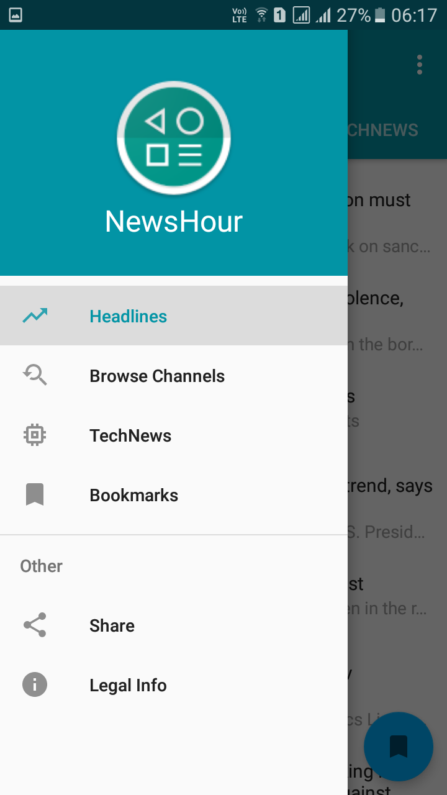

<h1 align="center">
    NewsHour
  <br>
</h1>
<h3 align="center">Your one-stop destination to all news.</h3>
<h4 align="center"> <i>Dedicated to news readers!</i></h4>
<h6 align="center"><a href="https://drive.google.com/uc?export=download&id=1D8xx4FX4onx4rrjow4zWKnjMcFxV3pD8"></a></h6>
<p align="center">
  <a href="https://github.com/AbsolutelySaurabh/NewHour#fork-destination-box">
    . Contribute .
  </a>
  <a href="https://drive.google.com/uc?export=download&id=1D8xx4FX4onx4rrjow4zWKnjMcFxV3pD8">
    . Download .
  </a>
</p>
<br>

## About NewsHour

```bash
App features:
This is a News Feed android app.
The user can navigate through fragments via tabs.
He/She also has the option to see the news of a particular channel which he choose.

```
  
## Screenshots  
     
   
      
             
    


  
## Development  
Want to contribute? **:pencil:**  
  
To fix a bug or enhance an existing module, follow these steps:  
  
1. Fork the repo
2. Create a new branch (`git checkout -b exciting-stuff`)
3. Make the appropriate changes in the files
4. Add changes to reflect the changes made
5. Commit your changes (`git commit -am 'exciting-stuff!!'`)
6. Push to the branch (`git push origin exciting-stuff`)
7. Create a Pull Request
  
  
## Interested?  
If you find a bug (the website couldn't handle the query and / or gave irrelevant results), kindly open an issue [here](https://github.com/AbsolutelySaurabh/NewHour/issues/new) by including your search query and the expected result.  
  
If you'd like to request a new functionality, feel free to do so by opening an issue [here](https://github.com/AbsolutelySaurabh/NewHour/issues/new) including some sample queries and their corresponding results.
  
  
## License

```bash

Copyright 2017 ShowCube.

Licensed to the Apache Software Foundation (ASF) under one or more contributor
license agreements. See the NOTICE file distributed with this work for
additional information regarding copyright ownership. The ASF licenses this
file to you under the Apache License, Version 2.0 (the "License"); you may not
use this file except in compliance with the License. You may obtain a copy of
the License at

http://www.apache.org/licenses/LICENSE-2.0

Unless required by applicable law or agreed to in writing, software
distributed under the License is distributed on an "AS IS" BASIS, WITHOUT
WARRANTIES OR CONDITIONS OF ANY KIND, either express or implied. See the
License for the specific language governing permissions and limitations under
the License.  
  ```
  [newsapi](http://www.newsapi.com/)

---

> GitHub [@AbsolutelySaurabh](https://github.com/AbsolutelySaurabh) &nbsp;&middot;&nbsp;
> Youtube [@appsomniac](https://www.youtube.com/channel/UCHO9VuIlUZj8eoKi1cXMOyA
